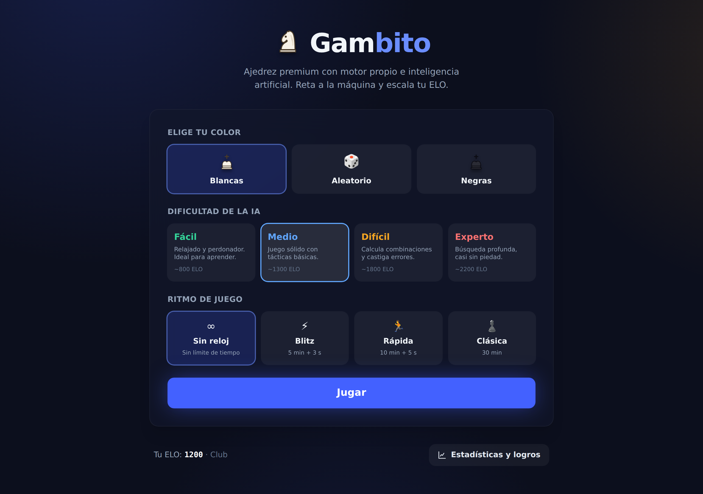

# ♟️ botAgedrez · Ajedrez

> En producción: **https://botagedrez.codezun.com**

Un juego de ajedrez web **premium**, construido desde cero: motor propio, IA con
minimax + poda alfa-beta corriendo en un Web Worker, sistema de ELO, logros,
animaciones fluidas y una identidad visual propia. Sin librerías de lógica de
ajedrez — todo el motor está implementado a mano y completamente desacoplado de
la interfaz.



## ✨ Características

### Motor de ajedrez (lógica pura, sin dependencias de UI)
- Representación de tablero compacta (`Uint8Array` de 64 casillas) e importación
  / exportación **FEN**.
- Generación de movimientos de las 6 piezas, capturas, **enroque** corto y largo
  (con todas sus condiciones), **captura al paso** y **coronación**.
- Detección de **jaque, jaque mate y ahogado**.
- Tablas por **triple repetición**, **regla de 50 movimientos** y **material
  insuficiente**.
- Validación completa de legalidad (ningún movimiento deja al rey propio en
  jaque).
- Generación de **notación algebraica estándar (SAN)** con desambiguación.
- Importación / exportación de partidas en **PGN**.
- Verificado con **perft** hasta profundidad 4 (197 281 nodos) y posiciones
  clásicas (Kiwipete, etc.).

### Inteligencia artificial
- **Negamax con poda alfa-beta**, ordenación de movimientos (MVV-LVA),
  **búsqueda de quiescencia** e **iterative deepening** con presupuesto de
  tiempo.
- Corre en un **Web Worker** para no bloquear la interfaz.
- **4 niveles** (Fácil, Medio, Difícil, Experto) variando profundidad y
  aleatoriedad.
- Función de evaluación: material, **piece-square tables**, seguridad del rey
  (con transición apertura→final), movilidad, estructura de peones y par de
  alfiles.

### Progresión
- Sistema **ELO** simplificado (empieza en 1200) con factor K dinámico.
- Material capturado por bando, racha de victorias, historial en `localStorage`.
- Panel de **estadísticas** con gráfica de ELO y **logros desbloqueables**.

### Experiencia
- Tablero con **drag-and-drop** y **click-to-move**, coordenadas, y resaltado de
  selección, movimientos legales, última jugada y **rey en jaque** (pulso rojo).
- Animaciones con **Framer Motion** (piezas deslizándose, coronación, confeti al
  ganar, transiciones de pantalla).
- **Sonidos** sintetizados con la Web Audio API (con botón de silencio).
- **Modo oscuro/claro**, totalmente **responsive**.

## 🧱 Stack

React + Vite + TypeScript · Tailwind CSS · Zustand · Framer Motion.
**Cero** dependencias de lógica de ajedrez.

## 📂 Estructura

```
src/
├── engine/     Motor puro: tablero/FEN, movimientos, ataques, estado, SAN, PGN
├── ai/         Evaluación, búsqueda (minimax/alfa-beta), dificultad, worker
├── store/      Estado global (Zustand)
├── hooks/      useAI, useClock, useSound, usePieceTracking, ...
├── components/ board · panel · screens · modals · stats · ui
├── utils/      elo, storage, achievements, stats, material, format
└── constants/  Geometría del tablero, ritmos de tiempo
```

La regla de oro: **el motor no sabe nada de la UI**. Todo en `engine/` y `ai/`
es data pura y funciones, ejecutable en tests o en un worker sin un DOM.

## 🚀 Desarrollo

```bash
npm install
npm run dev       # servidor de desarrollo
npm run build     # build de producción (type-check + bundle)
npm run test      # tests del motor y la IA (perft, mate, etc.)
npm run lint      # ESLint
```

## 🧪 Tests

Los tests del motor usan **perft** — el estándar de oro para validar un
generador de movimientos: cuenta los nodos hoja alcanzables a N jugadas y los
compara con valores de referencia exhaustivamente verificados. Coincidir con
ellos demuestra que enroque, al paso, coronación, clavadas y evasiones de jaque
son correctos.

```bash
npm run test
```

---

Hecho con cariño por el ajedrez. ¡Que disfrutes la partida!
